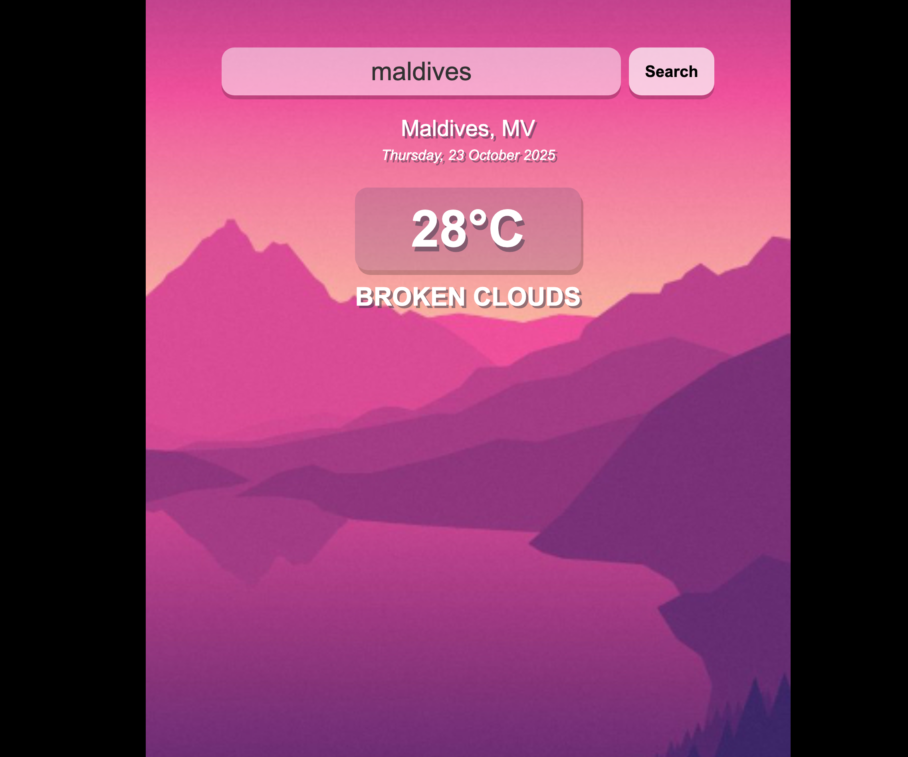

# 🌤 Weather App Poco

This is a simple weather app that shows the current weather of any city.  
It uses the **OpenWeatherMap API** to get weather data.

🔗 **Live Page:** [Weather App Poco](https://recep-demir.github.io/weather-app-poco/)

---

## 📷 Screenshot


---

## ⚙️ Features
- Search for any city
- Shows temperature and weather condition
- Dynamic background (warm or cold)
- Responsive design for mobile and desktop

---

## 🧩 Technologies Used
- HTML  
- CSS  
- JavaScript  
- [OpenWeatherMap API](https://openweathermap.org/)  
- [SweetAlert2](https://sweetalert2.github.io/)

---

## 🚀 How to Run
1. Clone or download this repository.  
2. Open `index.html` in your browser.  
3. Type a city name and press **Search**.

---

## 💡 API Key
You can get your own API key from [OpenWeatherMap](https://openweathermap.org/api)  
Then put it in `app.js`:
```js
const api = {
  key: "YOUR_API_KEY",
  base: "https://api.openweathermap.org/data/2.5/"
}
```

---

## 🧑‍💻 Authors
This project was created by a team:  

- **Recep Demir** → [@recep-demir](https://github.com/recep-demir)  
- **Burcu Aksoy** → [@burcuaksoy-ch](https://github.com/burcuaksoy-ch)  
- **Muhammet Şantas** → [@muhammetsnts](https://github.com/muhammetsnts)  
- **İlker Güler** → [@igulernavy](https://github.com/igulernavy)

---

### 📱 Responsive View
Works well on both desktop and mobile devices.
